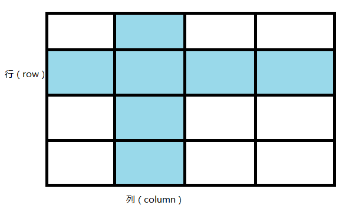
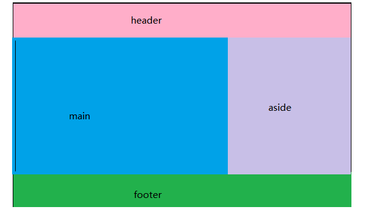

# 网格布局

它将网页划分成一个个网格，可以任意组合不同的网格，做出各种各样的布局。
## 一、概述
Grid 布局与 Flex 布局有一定的相似性，都可以指定容器内部多个项目的位置。但是，它们也存在重大区别。

Flex 布局是轴线布局，只能指定"项目"针对轴线的位置，可以看作是一维布局。Grid 布局则是将容器划分成"行"和"列"，产生单元格，然后指定"项目所在"的单元格，可以看作是**二维布局**。Grid 布局远比 Flex 布局强大。

## 二、基本概念
### 1、容器
采用网格布局的区域，称为"容器"（container）。

### 2、项目
容器内部采用网格定位的子元素，称为"项目"（item）。

```
<div>
  <div><p>1</p></div>
  <div><p>2</p></div>
  <div><p>3</p></div>
</div>

```
上面代码中，最外层的`<div>`元素就是容器，内层的三个`<div>`元素就是项目。

注意：项目只能是容器的顶层子元素，不包含项目的子元素，比如上面代码的`<p>`元素就不是项目。Grid 布局只对项目生效。

### 3、行 和 列
容器里面的水平区域称为"行"（row），垂直区域称为"列"（column）。


### 4、单元格
行和列的交叉区域，称为"单元格"（cell）。

正常情况下，n行和m列会产生n x m个单元格。比如，3行3列会产生9个单元格。

### 5、网格线
划分网格的线，称为"网格线"（grid line）。
水平网格线划分出行，
垂直网格线划分出列。


正常情况下，n行有n + 1根水平网格线，m列有m + 1根垂直网格线，比如三行就有四根水平网格线。

## 三、容器的属性
网格属性分为两类。一类定义在容器上面，称之为“容器属性”，另一类定义在项目上面，称之为“项目属性”

### 1、display 属性
display: grid指定一个容器采用网格布局。
```
div {
  display: grid;
}
```
**注意:**设为网格布局以后，容器子元素（项目）的
`float`、`display: inline-block、display: table-cell、vertical-align`和`column-`*等设置都将失效。

### 2、grid-template-columns 属性 和 grid-template-rows 属性
容器指定了网格布局以后，接着就要划分行和列。
#### （1）grid-template-columns属性定义每一列的列宽
#### （2）grid-template-rows属性定义每一行的行高

```
//css样式：
  <style>
      ul,
      li {
          list-style: none;
      }
      .box {
          display: grid;
          grid-template-rows: 100px 100px 100px;
          grid-template-columns: 100px 100px 100px;
      }
  </style>

  //html结构
  <ul class="box">
      <li>1</li>
      <li>2</li>
      <li>3</li>
      <li>4</li>
      <li>5</li>
      <li>6</li>
      <li>7</li>
      <li>8</li>
      <li>9</li>
  </ul>
```
上面代码指定了一个三行三列的网格，列宽和行高都是`100px。`
当然除了使用固定单位以外也可以使用%作为单位

```
 .box {
      display: grid;
      grid-template-rows: 33.33% 33.33% 33.33%;
      grid-template-columns: 33.33% 33.33% 33.33%;
  }
```
#### （3）repeat()
有时候，重复写同样的值非常麻烦，尤其网格很多时。这时，可以使用`repeat()`函数，简化重复的值。上面的代码用`repeat()`改写如下。
```
.box {
    display: grid;
    grid-template-columns: repeat(3, 33.33%);
    grid-template-rows: repeat(3, 33.33%);
}
```
`repeat()`接受两个参数，第一个参数是重复的次数（上例是3），第二个参数是所要重复的值。

`repeat()`重复某种模式也是可以的。

```
  .box {
      display: grid;
      grid-template-columns: repeat(2, 100px 200px 50px);
      grid-template-rows: repeat(2, 100px);
  }
```
#### （4）auto-fill 关键字
有时，单元格的大小是固定的，但是容器的大小不确定。如果希望每一行（或每一列）容纳尽可能多的单元格，这时可以使用`auto-fill`关键字表示自动填充。
```
  .box {
      width: 500px;
      display: grid;
      grid-template-columns: repeat(auto-fill, 100px);
      grid-template-rows: repeat(2, 100px);
  }
```
以上代码表示每列宽度100px，然后自动填充，直到容器不能放置更多的列。

#### （5）fr 关键字
为了方便表示比例关系，网格布局提供了`fr`关键字（`fraction` 的缩写，意为"片段"）。如果两列的宽度分别为`1fr`和`2fr`，就表示后者是前者的两倍。
```
  .box {
      width: 500px;
      display: grid;
      grid-template-columns: 2fr 3fr;
      /* grid-template-rows: repeat(2, 100px); */
  }
```
`fr`可以与绝对长度的单位结合使用，这时会非常方便。

```
  .box {
      width: 500px;
      display: grid;
      grid-template-columns: 100px 1fr 3fr;
      /* grid-template-rows: repeat(2, 100px); */
  }
```
  以上代码表示第一列宽度为100px，第二列是是第三列的1/3

  #### （6）auto 关键字
  `auto`关键字表示由浏览器自己决定长度。

  ### 3、grid-row-gap 属性、grid-column-gap 属性 和grid-gap 属性
  #### （1）grid-row-gap属性设置行与行的间隔（行间距）
  #### （2）grid-column-gap属性设置列与列的间隔（列间距）。
```
 .box {
      display: grid;
      grid-template-columns: 100px 100px 100px;
      grid-template-rows: 100px 100px 100px;
      grid-row-gap: 20px;
      grid-column-gap: 20px;
  }

  .box li {
      background: pink;
  }
```
#### (3)grid-gap属性是grid-column-gap和grid-row-gap的合并简写形式
`grid-gap: <grid-row-gap> <grid-column-gap>;`
```
  .box {
      display: grid;
      grid-template-columns: 100px 100px 100px;
      grid-template-rows: 100px 100px 100px;
      grid-gap: 20px 20px;
  }
```
如果grid-gap省略了第二个值，浏览器认为第二个值等于第一个值。

**根据最新标准，上面三个属性名的`grid-`前缀已经删除，`grid-column-gap`和`grid-row-gap`写成`column-gap`和`row-gap`，`grid-gap`写成`gap`。**

### 4、grid-template-areas 属性
网格布局允许指定"区域"（area），一个区域由单个或多个单元格组成。grid-template-areas属性用于定义区域。

一定要配合子元素的grid-area 属性使用

```
grid-template-areas:
              "header header header"
              "main main aside"
              "footer footer footer";
```

```
  .container {
        display: grid;
        grid-template-columns: 100px 100px 100px;
        grid-template-rows: 100px 100px 100px;
        grid-template-areas:
            "header header header"
            "main main aside"
            "footer footer footer";
    }

    .header {
        grid-area: header;
        background: pink;
    }

    .main {
        grid-area: main;
        background: green;
    }

    .sidebar {
        grid-area: aside;
        background: #ccc;
    }

    .footer {
        grid-area: footer;
        background: yellow;
    }
    
    <div class="container">
        <div class="header">header</div>
        <div class="main">main</div>
        <div class="aside">aside</div>
        <div class="footer">footer</div>
    </div>
```
**注意:**区域的命名会影响到网格线。每个区域的起始网格线，会自动命名为区域名`-start`，终止网格线自动命名为区域名`-end`。

比如，区域名为`header`，则起始位置的水平网格线和垂直网格线叫做`header-start`，终止位置的水平网格线和垂直网格线叫做`header-end`。

### 5、grid-auto-flow 属性
划分网格以后，容器的子元素会按照顺序，自动放置在每一个网格。默认的放置顺序是"先行后列"，即先填满第一行，再开始放入第二行，即下图数字的顺序。

这个顺序由`grid-auto-flow`属性决定，默认值是`row`，即"先行后列"。也可以将它设成`column`，变成"先列后行"。

设置为`grid-auto-flow: column;`后得到的效果


## 四、项目属性
### 1、grid-column-start 属性、grid-column-end 属性、grid-row-start 属性和grid-row-end 属性

项目的位置是可以指定的，具体方法就是指定项目的四个边框，分别定位在哪根网格线。
#### （1）grid-column-start属性：左边框所在的垂直网格线
#### （2）grid-column-end属性：右边框所在的垂直网格线
#### （3）grid-row-start属性：上边框所在的水平网格线
#### （4）grid-row-end属性：下边框所在的水平网格线


```
 .box li:nth-child(1) {
    grid-column-start: 1;
    grid-column-end: 3;
    grid-row-start: 2;
    grid-row-end: 4;
  }
```


这四个属性的值还可以使用span关键字，表示"跨越"，即左右边框（上下边框）之间跨越多少个网格。
```
  .box li:nth-child(1) {
    grid-column-start: span 2;
  }
```

1号项目的左边框距离右边框跨越2个网格。

### 2、grid-column 属性 和 grid-row 属性
`grid-column`属性是`grid-column-start`和`grid-column-end`的合并简写形式，
`grid-row`属性是`grid-row-start`属性和`grid-row-end`的合并简写形式。

```
.item {
  grid-column:  / ;
  grid-row:  / ;
}

```
例如：
```
.item-1 {
  grid-column: 1 / 3;
  grid-row: 1 / 2;
}
/* 等同于 */
.item-1 {
  grid-column-start: 1;
  grid-column-end: 3;
  grid-row-start: 1;
  grid-row-end: 2;
}
```
上面代码中，项目item-1占据第一行，从第一根列线到第三根列线。

这两个属性之中，也可以使用span关键字，表示跨越多少个网格。
```
  .item-1 {
    background: #b03532;
    grid-column: 1 / 3;
    grid-row: 1 / 3;
  }
/* 等同于 */
  .item-1 {
    background: #b03532;
    grid-column: 1 / span 2;
    grid-row: 1 / span 2;
  }
```
### 3、 grid-area 属性
grid-area属性指定项目放在哪一个区域。

`grid-area`属性还可用作`grid-row-start`、`grid-column-start`、`grid-row-end`、`grid-column-end`的合并简写形式，直接指定项目的位置。

```
.item {
  grid-area: <row-start> / <column-start> / <row-end> / <column-end>;
}

.item-1 {
  /*
      grid-column: 1 / 3;
      grid-row: 1 / 3;
  */
  grid-area: 1 / 1 / 3 / 3;
}
```
